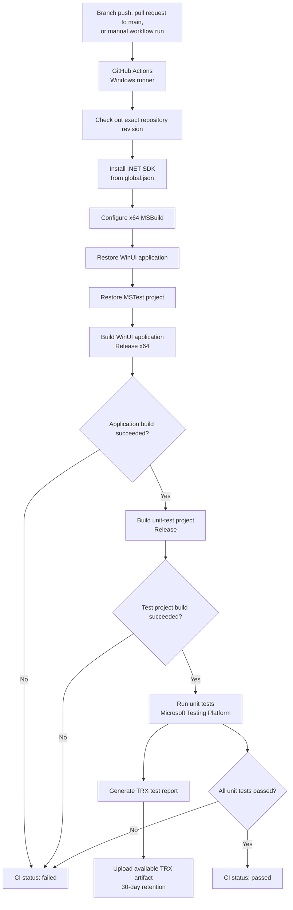

# CI Build-and-Test Workflow

**Version:** 1.0  
**Document type:** Engineering process view  
**Related engineering practice:** EP-018  
**Owner:** Project developer  
**Last reviewed:** 16 July 2026  
**Source of truth:** `.github/workflows/build-and-test.yml`  
**Status:** Implemented locally; GitHub-hosted validation pending  

## 1. Purpose

This document describes how the repository automatically restores,
builds and tests the Windows application after a branch push, a pull
request targeting `main`, or a manually requested workflow run.

This is a continuous-integration process diagram. It does not replace
the application's context, component, runtime or deployment
architecture views.

## 2. Current implemented workflow

